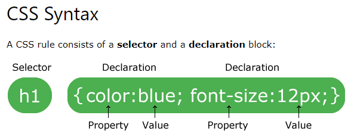

# Text

Headings

HTML has six "levels" of
headings:

<h1>  h1 is used for main headings
<h2>  h2 is used for subheadings
If there are further sections
under the subheadings then the
<h3>h3  element is used, and so
on.

______________________________________________

 *p* To create a paragraph, surround
the words that make up the
paragraph with an opening <p.>
tag and closing </p.> tag.

____________________________________________
<b>
By enclosing words in the tags
<b.> and </b.> we can make
characters appear bold.</b>

_____________________________________________

<br/.>
As you have already seen, the
browser will automatically show
each new paragraph or heading
on a new line. But if you wanted
to add a line break inside the
middle of a paragraph you can
use the line break tag <br/.>

_____________________________________________

Semantic Markup :e some text elements that are not intended to affect the
structure of your web pages, but they do add extra information to the
pages — they are known as semantic markup.

# Introducing CSS

CSS allows you to create rules that control the
way that each individual box (and the contents
of that box) is presented.

# Basic JavaScript Instructions

COMMENTS
You should write comments to explain what your code does.
They help make your code easier to read and understand.
This can help you and others who read your code. 

you can make a comments by two way 
-   /*        */ multibel line 
-  // one line 

## DATA TYPES

NUMERIC DATA TYPE
The numeric data type handles
numbers.
0.75 

STRING DATA TYPE
The strings data type consists of
letters and other characters.
'H.
1 ' Ivy! 1

BOOLEAN DATA TYPE
Boolean data types can have one
of two values: true or false.
true 

_______________________________________

ARRAYS
An array is a special type of variable. It doesn't
just store one value; it stores a list of values.

EVALUATIONS
You can analyze values in
your scripts to determine
whether or note they
match expected results.

 DECISIONS & LOOPS
DECISIONS
Using the results of
evaluations, you can
decide which path your
script should go down.

LOOPS
There are also many
occasions where you will
want to perform the same
set of steps repeatedly.

