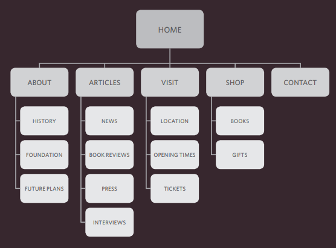
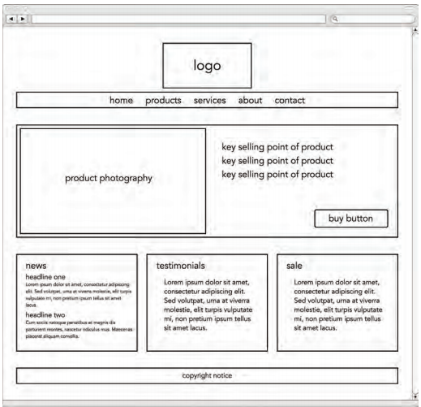

# Structure

The structure is very similar
when a news story is viewed
online (although it may also
feature audio or video). This is
illustrated on the right with a
copy of a newspaper alongside
the corresponding article on its
website.

HTML Describes
the Structure
of Pages

Tags act like containers. They tell you
something about the information that lies
between their opening and closing tags.

Ex:

# Extra Markup

 

# HTML5 Layout

<header.> <footer.>

 can be used for:

 - The main header or footer
that appears at the top or
bottom of every page on the
site.

- A header or footer for an
individual <article.> or
<section.> within the page.

<nav.>

 is used to
contain the major navigational
blocks on the site such as the
primary site navigation.

<article.>

The <article.> element acts as
a container for any section of a
page that could stand alone and
potentially be syndicated.

<aside.>

The <aside.> element has two
purposes, depending on whether
it is inside an <article.>
element or not.

<section.>

The <section.> element groups
related content together, and
typically each section would
have its own heading

# Process & Design

First you want to create a list
of reasons why people would
be coming to your site. You can
then assign the list of tasks to
the fictional visitors you created
in the step described on the
previous page.

Your content and design should
be influenced by the goals of
your users.

To help determine why people
are coming to your website,
there are two basic categories of
questions you can ask:

1.  The first attempts to discover
the underlying motivations for
why visitors come to the site.

2.  The second examines the
specific goals of the visitors.
These are the triggers making
them come to the site now.

### Site Maps 

 mean a create a diagram
of the pages that will be used
to structure the site

you will  know what needs to appear
on your site, you can start to organize the
information into sections or pages

*Example of Site Maps*

# WireFrames:

 is a simple sketch of the key
information that needs to go on each page of a
site. It shows the hierarchy of the information
and how much space it might require.

## Designing Navigation

helps them understand what your site is about and how it is organized.

